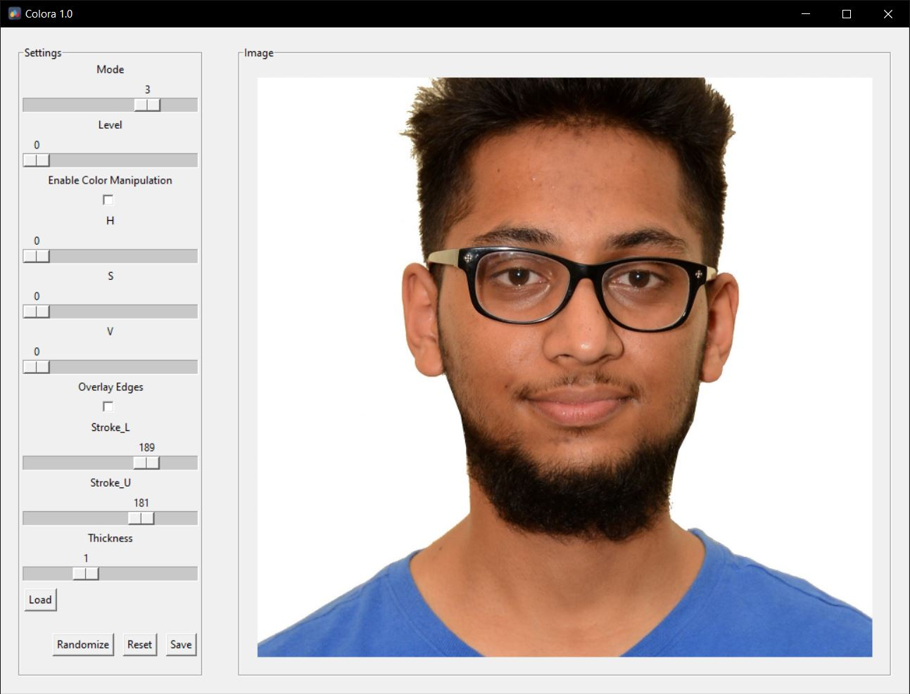
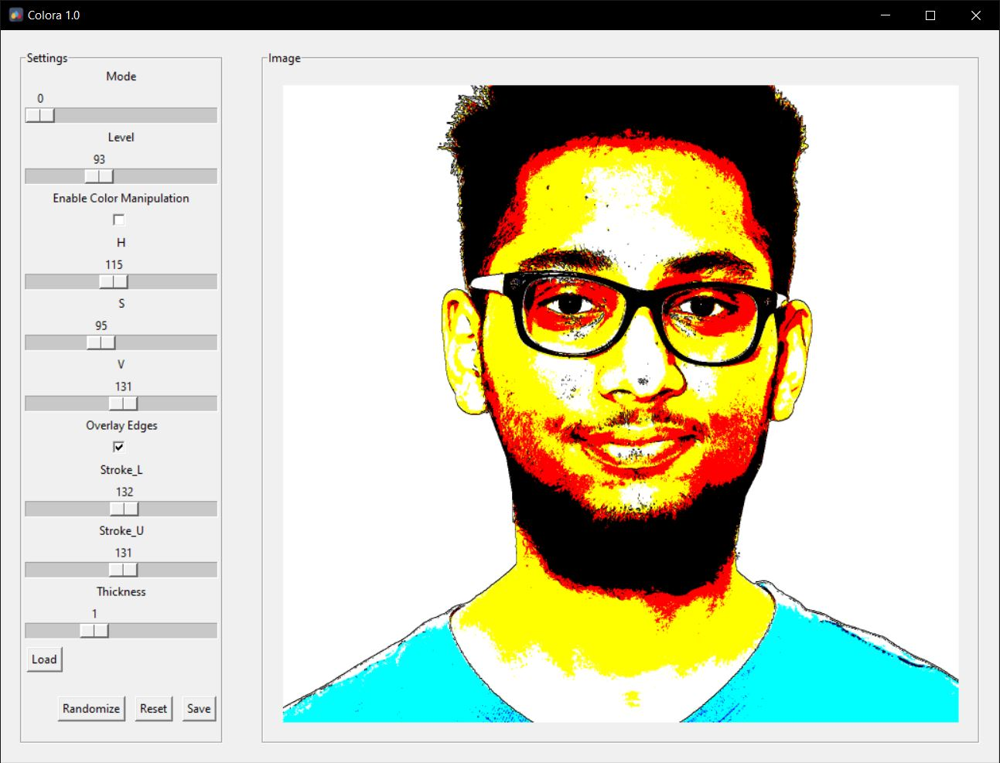
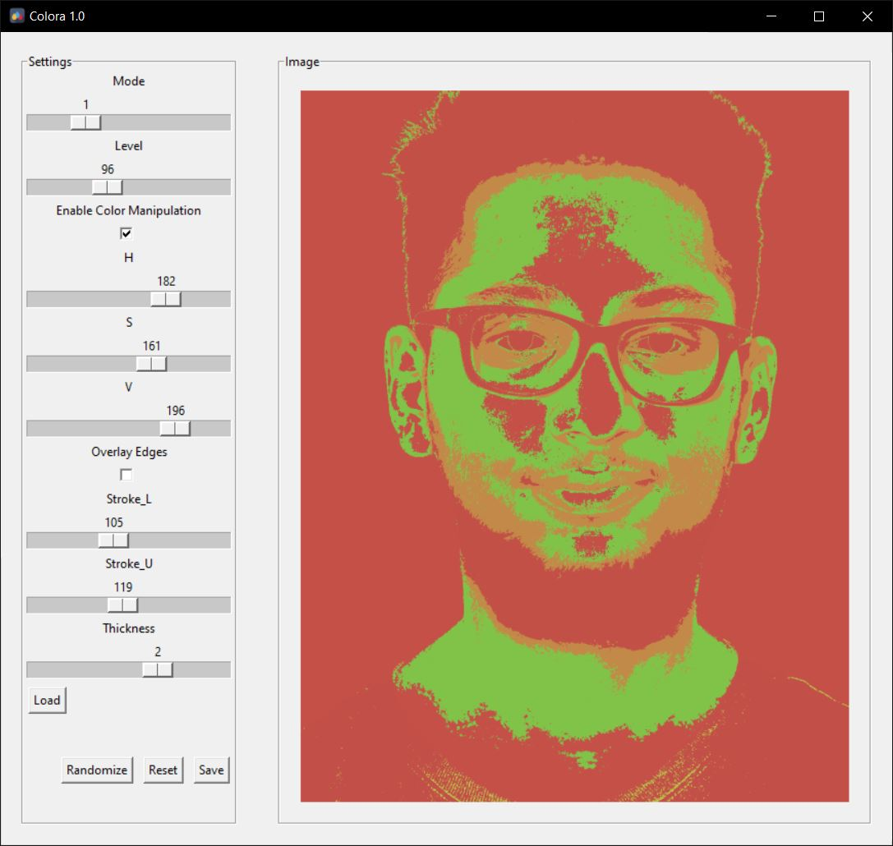

# Colora 1.0
Colora is an image editing app that creates unique vector-style edits. It automatically generates image while giving user sufficient control.

## Features
- Supports a number of image extensions
- Intuitive, simple and easy to use features
- Slider based controls
- Real-time performance
- Save images after edits

## Screenshots from the app

## Want to try it for yourself?
You can find the compiled distribution at https://drive.google.com/drive/u/0/folders/1tw11PJ95fVf9NEVYrtmemNPi2uLx1IeN. 

## New Version?
I'm working on other newer projects at the moment and not working on the software as of now. If you have any feedback or comments, please direct them to me at abhijanwasti@gmail.com. I will personally respond to you and might add them to the next version of Colora.
